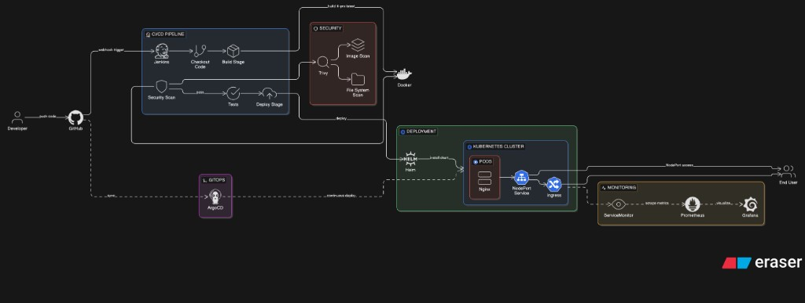
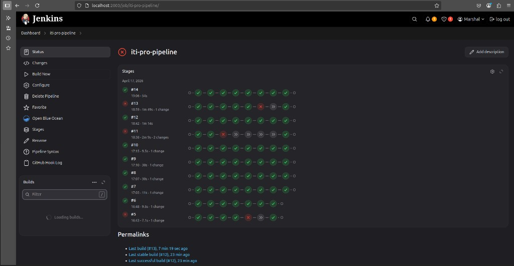
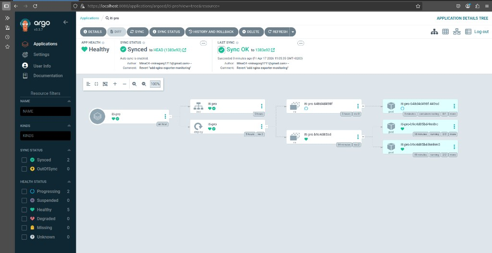
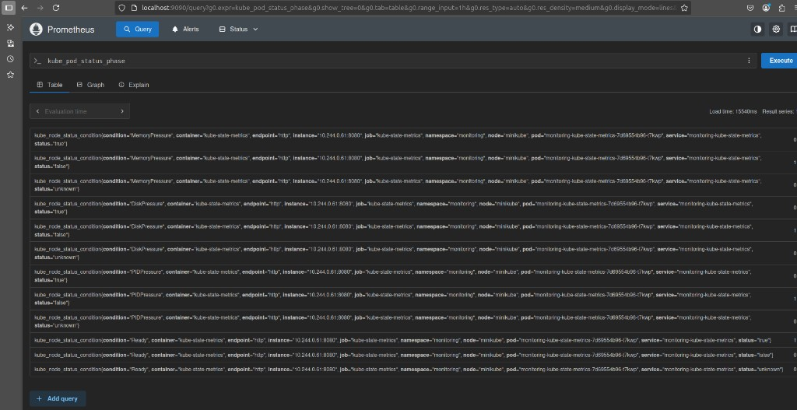
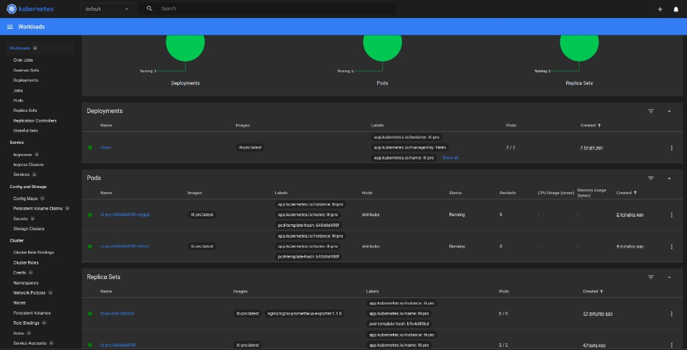

# DevSecOps Pipeline Project - Static Web App on Kubernetes

This project demonstrates a complete **DevSecOps workflow** for a simple static web application served by **Nginx**.  
It covers the full delivery lifecycle from source code to secure deployment using:

- **Jenkins** for CI/CD orchestration
- **Docker** for containerization
- **Kubernetes (Minikube)** for local cluster deployment
- **Helm** for reusable Kubernetes packaging
- **ArgoCD** for optional GitOps-based continuous delivery
- **Trivy** for container and filesystem vulnerability scanning
- **Prometheus & Grafana** (optional) for monitoring and observability

---

## Architecture Overview

End-to-end flow:

**Developer -> GitHub -> Jenkins -> Docker Build -> Trivy Scan -> Helm Deploy -> Kubernetes -> (Optional ArgoCD & Monitoring)**

### Pipeline Flow Details

1. Developer pushes code to GitHub.
2. Jenkins pipeline is triggered (`githubPush` trigger).
3. Jenkins checks out source code.
4. Docker image is built inside Minikube Docker daemon.
5. Trivy scans the image and repository for vulnerabilities.
6. Helm deploys/updates the release on Kubernetes.
7. Kubernetes runs the app and exposes it via Service/Ingress.
8. Optional:
   - ArgoCD continuously syncs manifests/charts from Git.
   - Prometheus scrapes metrics using `ServiceMonitor`, and Grafana visualizes dashboards.

---

## Project Structure



```text
.
|-- Dockerfile
|-- Jenkinsfile
|-- index.html
|-- script.js
|-- styles.css
|-- ingress.yaml
|-- argocd-iti-pro.yaml
|-- iti-pro-servicemonitor.yaml
|-- k8s/
|   |-- deployment.yaml
|   `-- service.yaml
`-- helm/
    |-- get_helm.sh
    `-- iti-pro/
        |-- Chart.yaml
        |-- values.yaml
        |-- .helmignore
        `-- templates/
            |-- _helpers.tpl
            |-- deployment.yaml
            `-- service.yaml
```

### Key Files

- `Dockerfile`: Builds the Nginx unprivileged image serving static files on port `8080`.
- `Jenkinsfile`: Defines CI/CD stages (checkout, build, Trivy scan, test, Helm deploy, verify).
- `k8s/`: Raw Kubernetes manifests (Deployment and Service).
- `helm/iti-pro/`: Helm chart used by Jenkins and ArgoCD deployments.
- `argocd-iti-pro.yaml`: ArgoCD `Application` manifest for GitOps sync.
- `iti-pro-servicemonitor.yaml`: Optional Prometheus Operator monitor configuration.

---

## Prerequisites

Install and configure the following tools:

- Docker
- Minikube
- kubectl
- Helm
- Jenkins (with required plugins and cluster access)
- Trivy
- Optional: ArgoCD CLI + ArgoCD server
- Optional: Prometheus + Grafana (or kube-prometheus-stack)

---

## Setup & Installation (خطوات التشغيل)

### 1) Start Minikube

```bash
minikube start
```

### 2) Enable Ingress Addon

```bash
minikube addons enable ingress
```

### 3) Build Docker Image Inside Minikube

```bash
eval $(minikube docker-env)
docker build -t iti-pro:latest .
```

### 4) Deploy with Helm

```bash
helm upgrade --install iti-pro helm/iti-pro \
  --namespace default \
  --set image.repository=iti-pro \
  --set image.tag=latest \
  --set image.pullPolicy=Never \
  --wait \
  --timeout 3m
```

### 5) Verify Deployment

```bash
kubectl get pods -l app.kubernetes.io/name=iti-pro
kubectl get svc iti-pro
kubectl rollout status deployment/iti-pro --timeout=90s
```

### 6) Access the Application

Option A - NodePort:

```bash
minikube service iti-pro --url
```

Option B - Ingress (if configured with host entries):

```bash
kubectl get ingress
```

---

## CI/CD Pipeline (Jenkins)

The `Jenkinsfile` implements the following stages:

1. **Checkout Code**
   - Pulls source code from SCM.

2. **Build Docker Image**
   - Switches Docker context to Minikube.
   - Builds `iti-pro:latest`.

3. **Security Scan (Trivy)**
   - Fails pipeline on `CRITICAL` image vulnerabilities.
   - Reports `HIGH` findings without failing build.
   - Scans filesystem for `HIGH,CRITICAL`.

4. **Tests**
   - Placeholder stage for unit/integration tests.

5. **Deploy (Helm)**
   - Runs `helm upgrade --install` with image overrides.

6. **Verify**
   - Checks pods/service and deployment rollout status.

---

## Security (Trivy)

Trivy is used as a quality gate in CI:

- Image scan (blocking):
  - `trivy image --exit-code 1 --severity CRITICAL iti-pro:latest`
- Image scan (non-blocking report):
  - `trivy image --exit-code 0 --severity HIGH iti-pro:latest`
- Filesystem scan (non-blocking report):
  - `trivy fs --exit-code 0 --severity HIGH,CRITICAL .`

### Severity Handling Strategy

- **CRITICAL** vulnerabilities: pipeline fails and deployment is blocked.
- **HIGH** vulnerabilities: logged for review/remediation, pipeline continues.

---

## ArgoCD (Optional)

This repository includes `argocd-iti-pro.yaml` to deploy the Helm chart via GitOps.

### Deploy ArgoCD Application

```bash
kubectl apply -f argocd-iti-pro.yaml
```

### Check and Sync

Using ArgoCD CLI:

```bash
argocd app get iti-pro
argocd app sync iti-pro
```

Using kubectl (status check):

```bash
kubectl -n argocd get applications
```

---

## Monitoring (Optional)

You can integrate Prometheus & Grafana for observability.

- Apply the provided ServiceMonitor:

```bash
kubectl apply -f iti-pro-servicemonitor.yaml
```

- Ensure Prometheus Operator selects the `release: monitoring` label.
- Confirm target discovery in Prometheus UI.
- Build Grafana dashboards for request rate, availability, and latency (if metrics are available).

### ServiceMonitor Purpose

`iti-pro-servicemonitor.yaml` tells Prometheus how to scrape the service endpoint (`port: http`, path `/`, interval `30s`) from the `default` namespace.

---

## Screenshots

### Jenkins Pipeline



### ArgoCD Application



### Prometheus Query View



### Kubernetes Dashboard



---

## Troubleshooting

### 1) `ImagePullBackOff`

**Cause:** Cluster cannot find image in a remote registry while image is local to Minikube.  
**Fix:**

```bash
eval $(minikube docker-env)
docker images | grep iti-pro
kubectl set image deployment/iti-pro iti-pro=iti-pro:latest
```

Also ensure Helm value is set:
- `image.pullPolicy=Never`

### 2) `CrashLoopBackOff`

**Cause:** App process fails, wrong port, or failing probes.  
**Fix:**

```bash
kubectl logs deployment/iti-pro
kubectl describe pod <pod-name>
```

Verify:
- Container listens on `8080`
- Liveness/readiness probes point to `/` on port `8080`

### 3) Resource Quota / Scheduling Errors

**Cause:** Insufficient CPU/memory in Minikube or strict namespace quotas.  
**Fix:**

```bash
kubectl describe quota
kubectl top nodes
minikube stop
minikube start --cpus=4 --memory=4096
```

You can also reduce Helm resource requests/limits in `helm/iti-pro/values.yaml`.

---

## Clean Up

Remove deployed resources:

```bash
helm uninstall iti-pro -n default
kubectl delete -f ingress.yaml --ignore-not-found
kubectl delete -f iti-pro-servicemonitor.yaml --ignore-not-found
kubectl delete -f argocd-iti-pro.yaml --ignore-not-found
```

Delete Minikube cluster:

```bash
minikube delete
```

